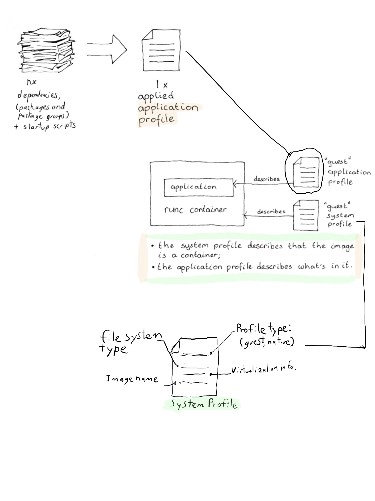

# Profiles
The concept of Application and System profiles comes from mion's parent, 
Oryx. The use and creation of profiles is well documented in the oryx 
[documentation](https://oryx.readthedocs.io/en/latest/building-images.html#).
> TODO: with mion superseding oryx, should oryx docs be ported over?
Rather than repeating what has already been said in the Oryx documentation, 
the goals here are:

* Give an overview of what the profiles are all about.
* Explain how they relate to OpenEmbedded and the Yocto Project.
* Go over about what's unique to mion.
* Provide some examples and illustrations to help further your understanding.

The concept of profiles are central to the containerised application approach of
mion: *a lightweight host environment installable across many
platforms, paired with guest application containers easily replaced or
updated securely.*

Simply,

* **System profiles**: how it will boot and run? Will it be a virtualised? Or
  will it be booted on bare metal? System profiles provide an easy way to manage
  these answers across many platforms.

* **Application profiles**: an image's *raison d’être*, from managing containers
  to providing an interface for network switches. (hint: from a container)  

### Table of Contents
[Introduction](#mion-application-and-system-profiles)

[Profiles and The Yocto Project](#profiles-and-the-yocto-project)

[Pairing Profiles](#pairing-profiles)

[Examples](#examples)

## Profiles and The Yocto Project

> *TODO: Add a diagram showing different work flows*

A question that can come up when discussing profiles is: **"How is
different from what's already in OpenEmbedded and the Yocto Project?"**

As mion and the Yocto Project ecosystem evolves, so does the answer. 
With new features such as multiconfig added to OpenEmbedded and the Yocto 
Project, mion will continue to incorporate and improve upon the implementation 
of a container focused embedded solution. 
 
mion profiles add abstraction which:
1. Supports the creation and use of containers.
2. Simplifies having to set a number of variables for each build.
3. Decouples what is needed to run the OS on the hardware and what an
   application requires, allowing a large degree of flexibility.


Additionally, **Application profiles allow for one file to define all necessary 
package and package groups, and their configuration.** While **System Profiles 
provide guest (container) or native (hardware) types and allows for a 
shared configuration across platforms**
> TODO: guest system profiles will likely be phased out, which will require
  a change to the above statement

Profiles are mion's solution to the problem of building embedded images to 
support containers.

Profiles can "require" another Application or System profile, however doing so 
is akin to inheritance; a required profile that is added 
upon. A host image with mender support includes the `host` application profile
with `require conf/application-profiles/host.conf`, as it serves a unique 
purpose but still needs the same requirements as host. If a profile includes
anything that isn't needed for a new use-case, creating a new profile should be 
considered. 

## Pairing profiles
When it comes to profiles, there are a few relationships to be aware of.
the general relationship are as follows:

**{ (guest-system, guest-application), (native-system, host-application) }**


When using the build script, a single set containing a system and application
can be built two ways:

```shell
./scripts/build.py -M <MACHINE> -S <SYSTEM PROFILE> -A <APPLICATION PROFILE>
# OR
./scripts/build.py -M <MACHINE> -T <SYSTEM PROFILE>:<APPLICATION PROFILE>
```
The `-T` argument can be more than once, where after each `-T`, a set can be
specified.

More interdependent relationships also exist:

**mion ONIE installer for ONLPV2  = { (guest, mion-guest-onlpv2),
                                   (mion-native-onie, mion-host-onie-onlpv2)}**

`./scripts/build.py -M stordis-bf2556x-1t -T guest:mion-guest-onlpv2 
  -T mion-native-onie:mion-host-onie-onlpv2`

While in some instances a guest system:application is paired and
"tightly coupled" with a host system:application set, this is not always the
case. A host mion image can have multiple application images. In fact, each
use-case should have a separate application image. See the page on
[mion containers](containers.md) for more information.

## Examples and Diagrams


> Application Profiles can include any number of packages, package groups, 
and scripts required by the main application. In this usage, package refers to 
the compiled binary produced by a recipe.


TODO: clean up image, walk through some examples. 
