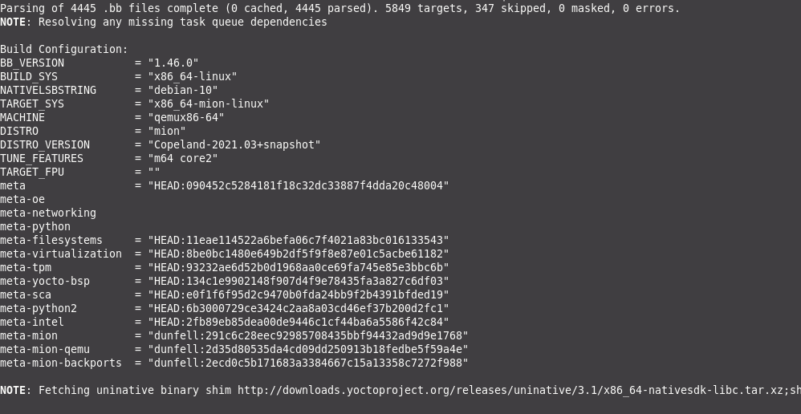
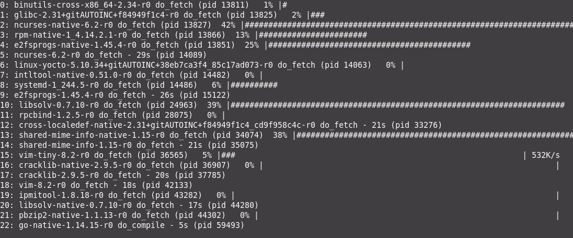

# Getting Started Guide

## Pre-Requirements

> This documentation is for mion dunfell-2021.06 "Dernish" release

If you are new to Yocto Project development, check out [Overview and Concepts](https://www.yoctoproject.org/docs/3.1.3/overview-manual/overview-manual.html)
and the [Quick Build](https://www.yoctoproject.org/docs/3.1.3/brief-yoctoprojectqs/brief-yoctoprojectqs.html)
guide to set up your build host and become familiar with the workflow. We
provide a quick overview below. Already familiar and want to get started
building mion? Then check out the mion [README](https://github.com/NetworkGradeLinux/mion)
for a quick-start guide.

## Build Host

Whether on a laptop or a high-powered build server, make sure that...

* You have 50 GB available

> *Why so much when the resulting image is so tiny? Think of it as a small cake;
Even if the end result can fit in a small box, you will still need a whole
kitchen in order to bake it.*

* git 1.8.3.1 or greater

* tar 1.28 or greater

* python 3.5.0 or greater

* gcc 5.0 or greater

### Ubuntu (16.04 -18.04) and Debian GNU/Linux (8.x-10.x)

```shell
sudo apt-get install gawk wget git-core diffstat unzip texinfo gcc-multilib \
     build-essential chrpath socat cpio python3 python3-pip python3-pexpect \
     xz-utils debianutils iputils-ping python3-git python3-jinja2 libegl1-mesa \
     libsdl1.2-dev pylint3 xterm
```

> for Ubuntu, make sure that you are using bash rather than dash:
`sudo dpkg-reconfigure dash` select `No` to use bash.

### Fedora (28-32)

```shell
sudo dnf install gawk make wget tar bzip2 gzip python3 unzip perl patch \
     diffutils diffstat git cpp gcc gcc-c++ glibc-devel texinfo chrpath \
     ccache perl-Data-Dumper perl-Text-ParseWords perl-Thread-Queue perl-bignum\
     socat python3-pexpect findutils which file cpio python python3-pip xz \
     python3-GitPython python3-jinja2 SDL-devel xterm rpcgen
```

### CentOS(7.x)

```shell
$ sudo yum install -y epel-release
$ sudo yum makecache
$ sudo yum install gawk make wget tar bzip2 gzip python3 unzip perl patch \
     diffutils diffstat git cpp gcc gcc-c++ glibc-devel texinfo chrpath socat \
     perl-Data-Dumper perl-Text-ParseWords perl-Thread-Queue python36-pip xz \
     which SDL-devel xterm

$ sudo pip3 install GitPython jinja2
```

### OpenSUSE Leap (15.1)

```shell
sudo zypper install python gcc gcc-c++ git chrpath make wget python-xml \
     diffstat makeinfo python-curses patch socat python3 python3-curses tar \
     python3-pip python3-pexpect xz which python3-Jinja2 Mesa-libEGL1 \
     libSDL-devel xterm rpcgen

$ sudo pip3 install GitPython
```

*The above requirements and build host packages are originally from Yocto
Project Quick Build Copyright 2010-2020 Linux Foundation, under the
[Creative Commons Attribution-Share Alike 2.0 UK: England & Wales](https://creativecommons.org/licenses/by-sa/2.0/uk/).
We added the cake.*

## Obtaining mion Sources

You're almost ready! Now obtain the *required* mion bitbake layers. Use either
the script `mion/contrib/clone_mion_repos.sh`, which clones all the
main public mion repos with a single command, or manually as shown below.

```shell
# To clone the submodules, `--recursive` is required
git clone --recursive https://github.com/NetworkGradeLinux/mion.git
cd mion
# To obtain mion distro layer:
git clone https://github.com/NetworkGradeLinux/meta-mion.git
# Obtain the mion hardware layers
git clone https://github.com/NetworkGradeLinux/meta-mion-bsp.git
# Backports for upstream repos not currently in the LTS release
git clone https://github.com/NetworkGradeLinux/meta-mion-backports.git
```

`mion` provides the build script (cronie.sh) and configuration files in
`build/conf/`. The `meta-mion` layer provides mion distro configuration, and
`meta-mion-bsp` is where support and configuration is found.
[Resources](resources.md) provides a detailed listing of all active mion repos.

## Basic Usage of Build Environment

To begin, set up the build environment using the OpenEmbedded init script:

```shell
source openembedded-core/oe-init-build-env
```

This will place you in the `build` directory.
Afterwords you can use our build script. Running `../cronie.sh` without
arguments displays basic usage. **In general:**

```shell
../cronie.sh -m <machine> <image>
```

Argument `<image>` must be provided last, as following arguments
would be passed to bitbake as part of the image name.

To do a "dry run" without running a build, add `-e` which emits what would have
run if you ran this from bitbake. For bitbake to attempt continuing in the
case of a build error, add `-k`.

> Note: The script can not always determine the vendor name, if you encounter
that issue, or just want to be sure, you can use `-v <VENDOR>` to specify.

## Build Script Examples

```shell

# Builds an ONLPV1 image onie image
../cronie.sh -m stordis-bf2556x-1t mion-onie-image-onlpv1

# Builds a QEMU with ONLPV1
../cronie.sh -v qemu -m qemux86-64 mion-image-onlpv1

```

## Image Creation

Once you've gone through the pre-requirements, have your build host set up, and
looked at the build script examples, you're ready to create an image yourself.

When you run `cronie.sh`, bitbake gets called, first parsing all
the recipes and making sure your `local.conf` and `bblayers.conf` looks good.
Next, bitbake gets to work "baking" your image!



> Much like a multilayer cake, how fast it gets finished is going to depend on
the quantity and complexities of the layers, and how reliable your baking setup
is!



While you enjoy a relaxing break, keep an eye on the screen for something like
this:


From the build directory, you'll find the finished images and related items such
as the onie-installer in `tmp-glibc/deploy/images/<VENDOR>-<MACHINE>/`

### Build Process

Plan on the initial run to take some time, with following builds being much
less. For a Linux VM with V Virtual CPUs and 32G RAM, a build will likely break
down as follows:

* *Fetching sources and setting up build environment*: **5 minutes**

* *Building of the image*: **3 hours**

* *Deploying mion via ONIE*: **5 minutes per switch**

You're finally done with this guide? Now it's time for
[Installing mion](installing-mion.md)!

If you've built the qemu image, from the build directory,
`runqemu tmp-glibc/deploy/images/qemux86-64/`

> runqemu may require setting up a tap interface. See `meta-mion-qemu/README`
for more information.
